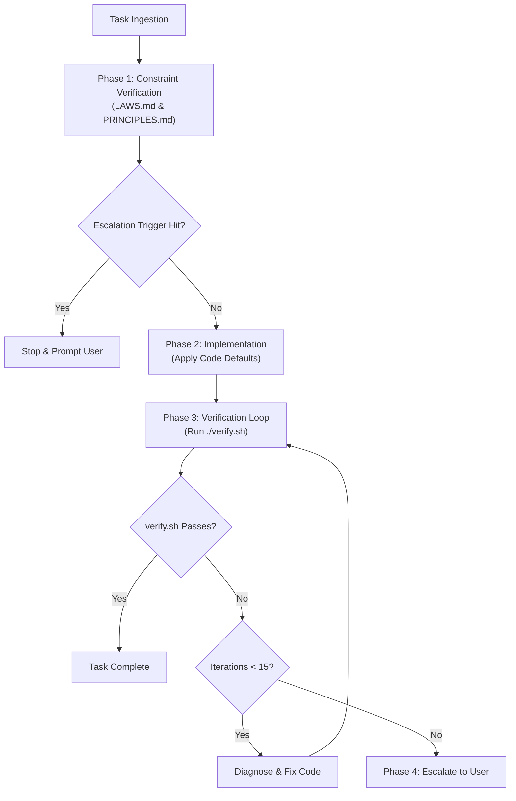

# Agent Operating Instructions & Governance

This document forms the operational runtime instructions for all AI coding agents working in this repository.

---

## Governance Hierarchy

All agent actions are governed by the following binding documents in strict order of precedence:

1. [`LAWS.md`](LAWS.md): Non-negotiable system invariants and data protection boundaries.
2. [`PRINCIPLES.md`](PRINCIPLES.md): Escalation triggers, code design defaults, and typing standards.
3. [`HARNESS.md`](HARNESS.md): Verification pipeline specifications and autonomous repair rules.

---

## Agent Execution Loop

Every agent task must follow this four-phase lifecycle:

### Phase 1: Constraint Verification
* Read [`LAWS.md`](LAWS.md). Ensure the planned modification does not violate Laws 1 through 5.
* **Strict Immutability:** Never modify or delete `LAWS.md` or any file within `tests/laws/`.
* Check [`PRINCIPLES.md`](PRINCIPLES.md) escalation triggers. If the task introduces external dependencies, changes public API contracts, or alters DB schemas, stop and ask the user for approval before modifying code.

### Phase 2: Implementation & Code Defaults
* Adhere to code defaults from [`PRINCIPLES.md`](PRINCIPLES.md):
  - Provide explicit domain errors; avoid silent `None` fallbacks.
  - Avoid premature abstractions; keep code readable and single-purpose.
  - Maintain type-safety with zero untyped bypasses.

### Phase 3: Autonomous Verification Loop
* Upon completing modifications, run `./verify.sh`.
* If `./verify.sh` fails, analyze the failure output and resolve the issue.
* Agents must autonomously attempt fixes and re-run `./verify.sh` up to **15 times** before escalating.

### Phase 4: Escalation Protocol
* Escalate only if:
  1. An explicit escalation trigger in [`PRINCIPLES.md`](PRINCIPLES.md) is activated.
  2. Resolving a task requires violating a rule in [`LAWS.md`](LAWS.md).
  3. The autonomous loop reaches 15 failed iterations on `./verify.sh`.
